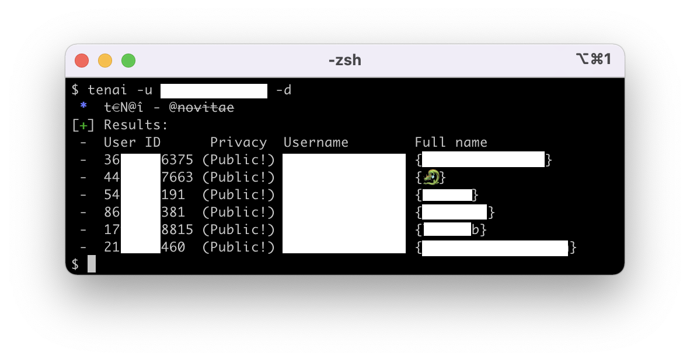

# Private Instagram Chaining
## 🔮 Uncover part of followers of an instagram private account

## 👉 Setup & Usage
### 📲 Installation
```python
pip install tenai
```
### 💻 Use it from Command Line
```python
# Print help
tenai -h/--help
# Usage
tenai -s/--session-id SESSIONID -u/--username USERNAME
```
- To export the result to json, add `-e/--export`
- To print urls instead of username, add `--url`
- To print details on account, add `-d/--details`
### 📇 Use it as a Library
```python
>>> from tenai import PrivateInstaChaining
>>> info = PrivateInstaChaining(session_id=SESSIONID)
>>> info.get_data(username=USERNAME)
{"users":[user,user...],"status":"ok","is_recommend_account":False}
```
## ✅ Target requirements
- ⚠️ Accounts with too few mutuals (**under ~20***) are automatically **protected against chaining**.
    - _You can't know how many mutuals a private account has if you're not following it._
- ⚠️ Accounts with **too much followers** (over ~15k*) **are also protected**.
- ⚠️ Accounts who **disabled [Similar account suggestions](https://help.instagram.com/530450580417848)** (very few) **are protected**.
- ⚠️ Accounts **followed by yourself are not targetable** (they're returning suggestions based on your own activity).
- ✅ All **accounts not mentionned in the previous lines are targetable** with this technique.

*_These numbers are approximative, based on the tests I made._
## 🗂 More
- 💡 `Tenai` comes from priva**TE** i**N**stagram ch**AI**ning.
- 🤫 The program **will**, of course, **not alert the target**.
- ⏳ Because of some pythonic part in the API response (`"sources": "[47, 11, 20]"` -> `"sources": str(list)`), **this technique might be exploiting a prototype in the API** that could be changed soon.
- 👀 This program is **using an offensive SOCMINT technique**, please use it only for investigative purposes. I am **not responsible of its misuse** !
## ⚙️ How does it works ?
When you're looking at a private account (on browser or app), there are suggestions of other accounts to follow. The API endpoint in charge of responding the accounts to display (`https://i.instagram.com/api/v1/fbsearch/accounts_recs/`), is responding for few weeks some new parameters, such as the following:
```json
"chaining_info": {
    "sources": "[11]",
    "algorithm": null
}
```
After many tests, I found out that `"sources"` can contain 3 different values with a certain signification for each:
- `"[11]"`, accounts following and being followed by the target account (mutuals), 
- `"[20]"`, your personnal suggestions influenced by your activity, 
- `"[47]"`, 2 accounts or more you follow are following this user.

The `"sources"` values can be additionned, such as `"[11, 47]"`, a mutual of your target followed by 2 or more of your friends.\
_Also, `"sources"` value is the pythonic value I'm talking about in [more](https://github.com/novitae/Tenai#-more), that seems to be a `str(list)`_.